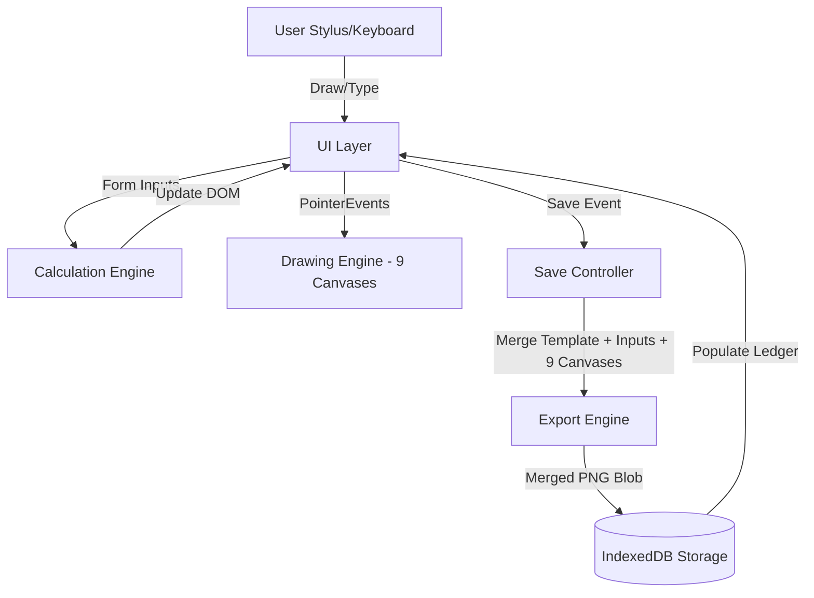

# InkVoucher — Engineering Design Doc

**Author:** Antigravity
**Status:** Draft v0.2
**Last updated:** 2026-06-22
**Reviewers:** TBD

---

## 1. Summary

We are building a local-first web application that merges handwritten item descriptions with automated digital calculations. The UI features a payment voucher slip containing 9 independent drawing canvases (8 for Particulars rows, 1 for the Authorized Signature), 16 numeric input fields (Quantity and Price for each of the 8 rows), a date picker, and a payment method toggle (Cash, Bank Transfer, PayNow). A real-time calculation engine computes line item amounts (`Qty × Price`) and sums them into a grand total. On saving, a high-resolution export engine draws the vintage background template, overlays the text inputs (including the calculated amounts), merges the 9 canvas drawing layers at their correct offsets, and commits the result to an IndexedDB store.

## 2. Assumptions

- **Target scale:** Fully local-first on-device application. Designed for a single tablet/device containing up to 10,000 vouchers (~2GB total storage).
- **Latency budget:** Drawing stroke rendering latency must be <16ms (60fps) on all 9 active canvases simultaneously. Calculations must execute on keyup/change events in <5ms.
- **Platform:** Modern tablet browsers supporting PointerEvents (for pressure sensitivity, stylus detection, and palm rejection).
- **Out of scope:** Server syncing, multi-device backup, OCR transcription.

## 3. Goals & non-goals

**Goals (v1):**
- Real-time arithmetic: `Line Amount = Qty × Price`, `Total Amount = Sum(Line Amounts)`.
- 9 independent, high-performance drawing canvases supporting Pencil (drawing in blue, black, or red ink) and Eraser (removing stroke pixels).
- Per-row clear buttons to wipe specific row handwriting, plus global clear buttons for drawing canvases and inputs.
- Date picker and payment method selection (Cash, Bank Transfer, PayNow).
- Saving the composite voucher image (handwriting + template + typed text inputs + auto-computed totals) as a high-resolution PNG in IndexedDB.
- Sidebar list history with search query indexing (by Voucher ID, date, or payment method).
- Voucher details modal with Download PNG and "VOID" stamp overrides.

**Non-goals (v1):**
- Inventory tracking or product catalog search.
- Financial accounting ledger exports.
- Cloud syncing or REST APIs.

---

## 4. Architecture

The application is a single-page web app built on standard Web APIs.



**What's here:**
- **Drawing Engine:** A modular class instantiated for all 9 canvases, handling path creation, active tool (Pencil/Eraser), and line width/color.
- **Calculation Engine:** Listens to inputs in the `qty` and `price` classes, calculates line totals and grand totals, and formats results.
- **Export Engine:** A programmatic high-resolution renderer that recreates the full voucher template, draws all textual values, aligns and renders the 9 canvases at their precise pixel coordinates, and outputs a compressed PNG blob.
- **IndexedDB Storage:** Persists voucher metadata and the compiled PNG image.

---

## 5. Key components

### DrawingEngine
- **Responsibility:** Captures pointer paths for a specific canvas. Handles pen vs eraser (`ctx.globalCompositeOperation = 'destination-out'` for erasing; `'source-over'` for drawing).
- **Interface:**
  - `constructor(canvasElement)`: Sets up scaled backing store for retina screens and attaches listeners.
  - `setTool(type)`: Sets drawing mode (`pencil` or `eraser`).
  - `setColor(color)`: Sets drawing color.
  - `setWidth(width)`: Sets stroke width.
  - `clear()`: Wipes canvas.

### CalculationEngine
- **Responsibility:** Listens to inputs on numeric fields, validates numbers, updates individual row total displays, and computes the grand total.
- **Interface:**
  - `recalculate()`: Iterates through the 8 rows, reads `Qty` and `Price`, calculates row amount, and sums all rows to write to the grand total element.

### ExportEngine
- **Responsibility:** Programmatic canvas builder. Compiles the background yellow paper, draws text grids, overlays the 9 canvas layers, and exports a PNG.

---

## 6. Data model

Vouchers are saved in an IndexedDB database named `InkVoucherDB`.

```typescript
type Voucher = {
  id: string;               // e.g. "V-0001" (Primary Key)
  sequenceNumber: number;   // Auto-increment sequence integer
  createdAt: number;        // Save epoch timestamp
  date: string;             // Date picker selected date (yyyy-mm-dd)
  paymentMethod: 'Cash' | 'Transfer' | 'PayNow';
  status: 'Active' | 'Void';
  totalAmount: number;      // Calculated grand total
  items: Array<{
    rowIndex: number;
    qty: number;
    price: number;
    amount: number;
  }>;
  imageBlob: Blob;          // High-resolution compiled PNG slip
};
```

---

## 7. API surface (Internal Call Graph)

### `recalculateTotals()`
- **Trigger:** Listeners on any `.qty-input` or `.price-input` keyup/change events.
- **Latency:** <2ms.

### `compileAndSave(metadata)`
- **Input:** `metadata: { date: string, paymentMethod: string }`
- **Output:** `Promise<string>` (Voucher ID)
- **Process:** Wipes active states, combines 9 canvases and inputs onto export template, compresses to PNG, writes to DB.
- **Latency:** <400ms.

---

## 8. Key trade-offs (with rejected alternatives)

### Decision: 9 Canvas Elements vs. 1 Giant Canvas
- **Chose:** 9 Canvas elements.
- **Considered:** 1 single canvas overlaying the entire voucher card, catching drawing coordinates everywhere.
- **Why we picked this:** 9 separate canvas elements allow native HTML text inputs to be placed between drawing columns (Particulars column vs Qty/Price columns). If we had 1 giant canvas, we would have to implement a custom virtual keyboard, cursor focus, and text rendering engine to handle typed numeric inputs, which is highly complex, prone to bugs, and breaks native tablet keyboards. Having 9 small canvases is extremely lightweight for modern mobile browser engines and preserves native HTML input benefits.

---

## 9. Risks & unknowns

- **Context Loss/Performance on Mobile Safari:** Renders can lag if 9 canvases redraw too heavily.
  - *Mitigation:* We do not redraw canvases continuously; canvases only draw on active stylus path strokes. All drawing operations are isolated to the active canvas where the stylus is interacting.
- **Eraser Tool on HTML5 Canvas:** Erasing a row canvas should not delete the yellow background.
  - *Mitigation:* Active drawing canvases are transparent (`rgba(0,0,0,0)`) overlays. The yellow paper slip template is a separate HTML container underneath. Therefore, setting `globalCompositeOperation = 'destination-out'` correctly erases the drawn lines on the canvas without modifying the background template.

---

## 10. Testing strategy

**Unit Tests:**
- `calculateRowAmount(qty, price)`: Verifies floating point math (e.g. `0.1 + 0.2` rounding issues).
- `sumTotalAmount(amounts)`: Verifies array sum calculations.

**Integration Tests:**
- `dbSaveRetrieveCycle`: Tests writing a full hybrid voucher structure (metadata, inputs, mock blobs) to IndexedDB and reading it back.
